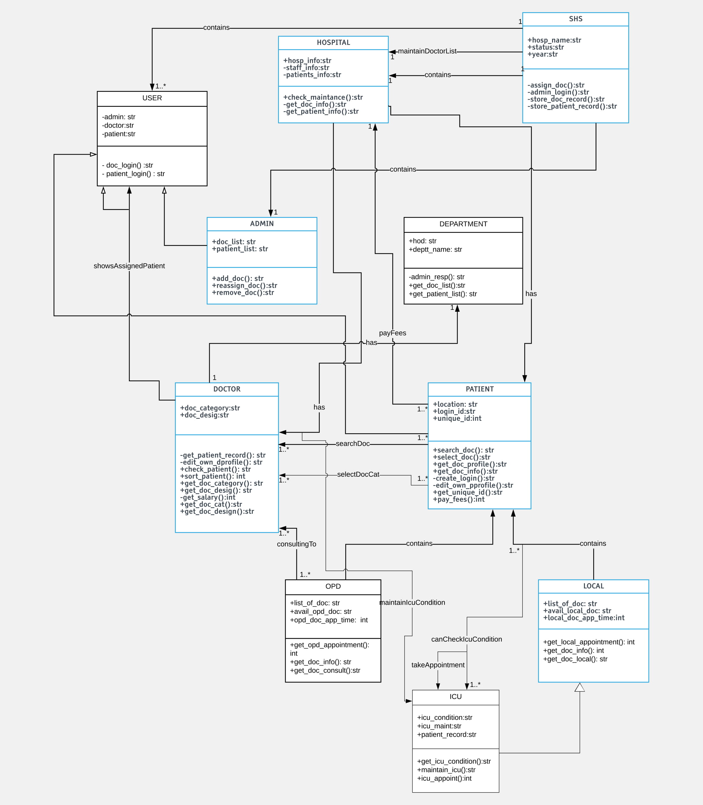

# OOPD

# Smart Health Project

______________________________________________________________________________
The project relates to design and development of a Smart Healthcare System (SHS) that will allow a
hospital to assign doctors to patients. The patients can get all the required details like availability, OPD
timings, contact information about the doctors etc.
A. The operational requirements of the system are:
1. Patient can search the doctors based on the categories listed in the SHS application i.e.
Orthopedic, General Physician etc. Patients can select a particular doctor as per their
requirements. Patients can also see doctor’s profile. Also, the patient can view doctor’s
schedule, contact details like address and phone number to look for an appointment.
2. After successful registration, each patient is allocated a unique id. The id should be meaningful
so that it is easy to identify the category or department in which a patient is registered.
3. When a patient registers, an option of “location” is provided. The “location” can be OPD or
LOCAL. OPD means that a patient needs a consultation in the hospital. LOCAL means the patient
needs to be hospitalized in the hospital.
4. Either a patient has an option to select a doctor ~~or the SHS will allocate the doctor to patient. In
~~case of SHS allocating the doctor, one should add an intelligent algorithm for such matching~~
5. SHS will maintain the details about all the doctors in the hospital. The doctors are divided into
junior residents, senior residents, specialists and senior specialists. ~~Each department/category is
headed by a head of the department (HoD). The HoD is a senior specialist with some
administrative responsibilities.~~ Some of the doctors are also surgeons and senior surgeons. A
department consists of a team of doctors – a combination of junior and senior residents, one or
more specialist and senior specialist.
6. All doctors conduct OPD and the timings are specified in their profile. Any junior doctor can refer
patients to a doctor senior to him in the same department.
7. ~~Only the specialist or senior specialist can refer a patient to another department.~~
8. Whenever a patient visits hospital, either as OPD patient or as LOCAL patient, all his data like
day and time of visit, day and time of discharge, department, doctor or doctors, disease
identified, medicines prescribed, other tests advised etc. are recorded.
9. ~~When a doctor logs into the SHS system, it shows the list of assigned patients (since his last~~
~~login). The doctor can sort the patients based on patient id, name and type.~~
10. The system will also show the patient available history to the assigned doctor
11. The patients can also be critical or non-critical. The critical patients may need a surgeon.
B. Users of the system
There are three main type of users of SHS and all users are allowed to access the system by login
id and password,
1. Patients: Patients need to register and create login for the first time. Later on, they can use
same login and password to access the system. Patients can edit their profile. The new user
needs to register by providing few details like name, phone number etc. The doctor can be
searched by doctor’s ID or name or address or specialization.
2. Doctors: A doctor can also edit his profile. Once the doctor logs in, he can check the patients
who need his help. Doctor should able to sort the list of patients.
3. Admin: Admin can add the doctors in the SHS. The login and password for admin is created
by default by SHS. Reassignment of doctors in patients record, if any, can be done by the
admin. Also, the admin has the right to view the details of any patient and any doctor.
C. System Requirements:
1. The system can be console based or can have a GUI for user interactions .
2. The system must include a database in which records of patients and the doctors will be
stored.
3. Exception handling must be implemented wherever possible. All the exceptions must be
logged into a log file.
4. ~~Once your project is complete, design the test cases for each subsystem. At least 5 test~~
~~cases for each class must be made. (Optional: Junit or Pyunit can be used for unit testing.)~~
5. Some data for patients as well as doctors should be available in the Mysql DB for testing and
for demo.
Bonus: The bonus points will be provided for extra features you add in the system and it will be
evaluated on case to case basis. For example, some bonus points will be awarded if you
construct state diagrams also in UML diagrams before deadline 1.

# UML

